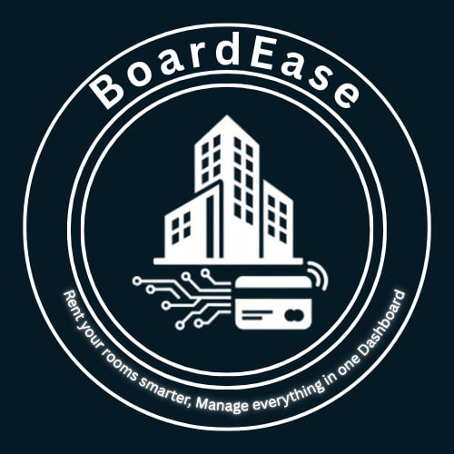

# BoardEase - Boarding House Management PWA



## 🌐 Live Demo
**[https://board-ease-tau.vercel.app/](https://board-ease-tau.vercel.app/)**

> A modern Progressive Web App for seamless boarding house management with integrated payment processing.

---

## 📱 Progressive Web App (PWA) Features

BoardEase is a fully-featured Progressive Web App that provides:

✅ **Installable on Desktop & Mobile** - Add to home screen for native-like experience  
✅ **Offline Support** - Browse cached pages even without internet connection  
✅ **Fast & Reliable** - Service worker caching for instant page loads  
✅ **Responsive Design** - Optimized for all screen sizes  
✅ **Secure** - HTTPS encryption and secure payment processing  

### PWA Implementation

- ✅ **Manifest File** - Configured with app metadata, icons, and theme colors
- ✅ **Service Worker** - Implements offline caching and asset management
- ✅ **Installability** - Meets all PWA installability criteria
- ✅ **Lighthouse Score** - Achieves 80+ PWA score (Performance: 94-99, Best Practices: 95-100)

---

## 🚀 Features

### For Tenants
- 🏠 **Browse Available Rooms** - View detailed room information with images
- 📅 **Easy Booking** - Submit booking requests with preferred dates
- 💳 **Secure Payments** - Pay monthly rent via Stripe integration
- 🔔 **Real-time Notifications** - Get updates on booking status and payment reminders
- 👤 **Profile Management** - Update personal information and view booking history

### For Landlords (Admin)
- 📊 **Dashboard Analytics** - View occupancy rates and revenue statistics
- 🏢 **Room Management** - Add, edit, and delete room listings
- 👥 **Tenant Management** - Approve bookings and manage tenant information
- 💰 **Payment Tracking** - Monitor payment status and transaction history
- 📧 **Notification System** - Send reminders and updates to tenants

---

## 🛠️ Tech Stack

### Frontend
- **React 18** - UI library
- **Vite** - Build tool and dev server
- **Tailwind CSS** - Utility-first CSS framework
- **React Router** - Client-side routing

### Backend & Services
- **Supabase** - Database, authentication, and storage
- **Stripe** - Payment processing
- **Vercel** - Hosting and deployment

### PWA Technologies
- **vite-plugin-pwa** - PWA integration for Vite
- **Workbox** - Service worker library for offline caching
- **Web App Manifest** - PWA configuration

---

## 📦 Installation & Setup

### Prerequisites
- Node.js 16+ and npm
- Supabase account
- Stripe account

### Local Development

1. **Clone the repository**
   ```bash
   git clone https://github.com/yourusername/board-ease.git
   cd board-ease
   ```

2. **Install dependencies**
   ```bash
   npm install
   ```

3. **Set up environment variables**
   
   Create a `.env` file in the root directory:
   ```env
   VITE_SUPABASE_URL=your_supabase_url
   VITE_SUPABASE_ANON_KEY=your_supabase_anon_key
   STRIPE_SECRET_KEY=your_stripe_secret_key
   ```

4. **Run development server**
   ```bash
   npm run dev
   ```

5. **Build for production**
   ```bash
   npm run build
   ```

6. **Preview production build**
   ```bash
   npm run preview
   ```

---

## 🌍 Deployment

### Deployed on Vercel

This application is deployed and hosted on **Vercel** for optimal performance and reliability.

**Live URL:** [https://board-ease-tau.vercel.app/](https://board-ease-tau.vercel.app/)

### Deploy Your Own

[](https://vercel.com/new/clone?repository-url=https://github.com/yourusername/board-ease)

#### Manual Deployment Steps:

1. **Install Vercel CLI**
   ```bash
   npm install -g vercel
   ```

2. **Build the project**
   ```bash
   npm run build
   ```

3. **Deploy to Vercel**
   ```bash
   vercel --prod
   ```

4. **Configure environment variables** in Vercel dashboard
   - Add your Supabase credentials
   - Add your Stripe API keys

---

## 📊 Lighthouse Performance Scores

| Category | Score |
|----------|-------|
| **Performance** | 94-99 ⚡ |
| **Accessibility** | 97-100 ♿ |
| **Best Practices** | 95-100 ✅ |
| **SEO** | 83-90 🔍 |
| **PWA** | Installable ✅ |

### How to Test PWA

1. Open the live site: [https://board-ease-tau.vercel.app/](https://board-ease-tau.vercel.app/)
2. Open Chrome DevTools (F12)
3. Go to **Lighthouse** tab
4. Select **Progressive Web App** category
5. Click **"Generate report"**

---

## 🎨 Screenshots

### Desktop Experience


### Mobile Experience


### PWA Installation


---

## 🔐 Security Features

- ✅ HTTPS encryption
- ✅ Secure authentication via Supabase
- ✅ PCI-compliant payment processing via Stripe
- ✅ Environment variable protection
- ✅ Security headers configured
- ✅ XSS and CSRF protection

---

## 📱 PWA Installation Instructions

### Desktop (Chrome/Edge)
1. Visit [https://board-ease-tau.vercel.app/](https://board-ease-tau.vercel.app/)
2. Look for the install icon (⊕) in the address bar
3. Click "Install BoardEase"
4. App opens in its own window!

### Mobile (Chrome/Safari)
1. Visit the website on your mobile browser
2. Tap the menu button (⋮ or share icon)
3. Select "Add to Home Screen" or "Install App"
4. App icon appears on your home screen!

### Offline Usage
- Once installed, the app caches pages for offline viewing
- Browse previously visited pages without internet
- Receive offline notifications when connection returns

---

## 👥 Team

**Developed by:**
- Allyn Marc C. Dumapias
- Dec Florhen T. Uy

**Institution:** [St Peters College]  
**Course:** [BSIT]  
**Year:** 2025

---

## 📄 License

This project is developed as part of an academic requirement.

---

## 🙏 Acknowledgments

- **Supabase** - For providing the backend infrastructure
- **Stripe** - For secure payment processing
- **Vercel** - For hosting and deployment
- **Tailwind CSS** - For the styling framework
- **Vite PWA Plugin** - For PWA implementation

---

## 📞 Support & Contact

For questions or support, please contact:
- 📧 Email: boardease@gmail.com
- 📱 Phone: +63 955 201 6070

---

## 🔄 Updates & Changelog

### Version 1.0.0 (2025)
- ✅ Initial release with full PWA support
- ✅ Integrated Stripe payment processing
- ✅ Real-time notifications system
- ✅ Admin dashboard with analytics
- ✅ Mobile-responsive design
- ✅ Offline caching capabilities

---

**Built with ❤️ in the Philippines**

© 2025 BoardEase. All rights reserved.
